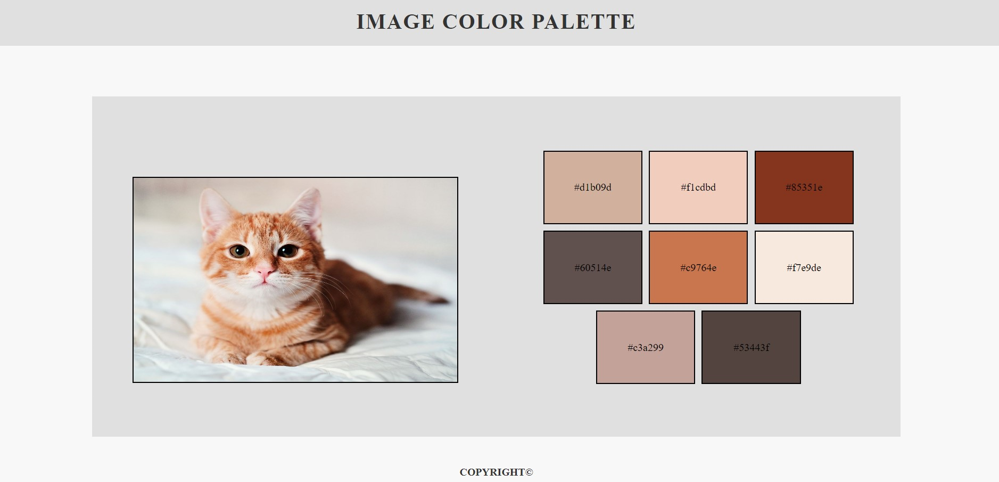

# Image Color Palette


<br><br>


> A Flask web application to generate color palettes from images. Upload an image, and the application will display the image along with the dominant color palette.

## 🌟 Features

- Upload an image to generate its color palette.
- Choose the number of colors you want to see in the palette.
- View the image and its color palette on the result page.

## 📂 Files

- **functions.py**: Contains the function `get_colors` that extracts color palettes from an image.
- **server.py**: The Flask application script with routes and image processing logic.
- **templates/index.html**: HTML template for the main page with image upload and color count options.

## 🛠️ Usage

1. Run the Flask application using `python server.py`.
2. Open your web browser and go to `http://127.0.0.1:5000/`.
3. Upload an image by clicking on "Upload your image."
4. Choose the number of colors you want to see in the palette.
5. Click "Send" to generate the color palette.
6. View the uploaded image along with the generated color palette.

## 🔧 Dependencies

- Flask
- Pillow (PIL)

## 💻 How it Works

1. The user uploads an image.
2. The Flask application saves the image in the `static/uploads` folder.
3. The application generates the color palette using the `get_colors` function from `functions.py`.
4. The image along with the color palette is displayed on the result page.

## 🚀 Getting Started

To get a local copy up and running, follow these simple steps:

1. **Clone the repository**:
    ```sh
    git clone https://github.com/giovananog/image-color-palette.git
    ```
2. **Navigate to the project directory**:
    ```sh
    cd image-color-palette
    ```
3. **Run the Flask application**:
    ```sh
    python server.py
    ```

## 🎓 Developed During Python Bootcamp

This Image Color Palette project was developed as part of the 100 Days of Code - The Complete Python Pro Bootcamp ([Course](https://www.udemy.com/course/100-days-of-code/)). It showcases the skills acquired during the course, including web development with Flask, image processing with Pillow, and user interface design with HTML templates.

